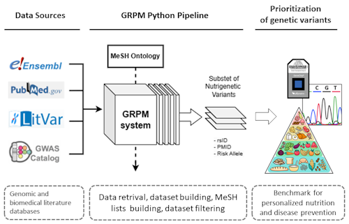
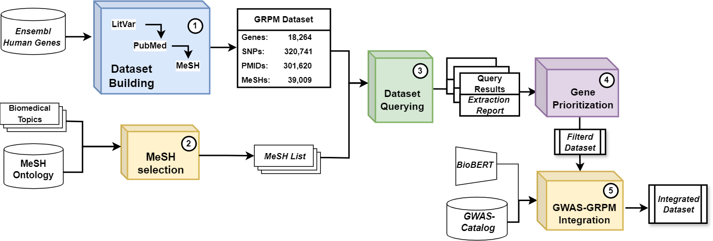

# GRPM System 2.0

The GRPM (Gene-Rsid-Pmid-Mesh) system is an advanced tool designed for the integration and analysis of genetic polymorphism data corresponding to specific biomedical domains. It consists of five modular components that facilitate data retrieval, merging, analysis, and the incorporation of GWAS data.

[](https://www.medrxiv.org/content/10.1101/2023.08.04.23293659v1.full.pdf+html) [](https://doi.org/10.5281/zenodo.8205724)

## Overview

- [Introduction](#introduction)
- [Modules](#modules)
- [Updates](#updates)
- [Installation](#installation)
- [Usage](#usage)
- [Requirements](#requirements)

## Introduction

The GRPM System is a Python-based framework capable of constructing a comprehensive dataset of human genetic polymorphisms associated with nutrition. By integrating data from multiple sources and utilizing MeSH ontology as an organizational structure, this workflow enables researchers to investigate genetic variants with significant associations to specified biomedical subjects. The primary objective of developing this resource was to support nutritionists in exploring gene-diet interactions and implementing personalized nutrition strategies.




## Installation

You can query the developed datasets by installing the package via:

```
pip install git+https://github.com/johndef64/GRPM_system.git
```

Example queries are available in the `test` directory. Try it in Colab: [](https://colab.research.google.com/github/johndef64/GRPM_system/blob/main/test.ipynb) 

Alternatively, execute each module separately in Google Colab with Google Drive synchronization to preserve progress.

To explore the complete repository, clone it locally:

```
git clone https://github.com/johndef64/GRPM_system.git
```

## Usage

Comprehensive instructions for the usage of each module within the GRPM System are found within the respective Jupyter Notebooks within the repository. Follow the guidelines closely and install the necessary Python packages specified for each module.

## Modules

The GRPM System is composed of five distinct modules, each executing a crucial function to assist in the integration and analysis of genetic polymorphism data associated with nutrition. The modules are outlined below:

To evaluate the our pipeline, execute each module individually by selecting the "Open in Colab" option. Ensure that all necessary dependencies and files are imported. Google Drive synchronization is available.

Each Jupyter notebook includes code to download and install the necessary dependencies for execution.

| No. | Notebook | Module | Description |
| --- | --- | --- |-------------|
| 1. | [](https://colab.research.google.com/github/johndef64/GRPM_system/blob/main/GRPM_01_main_dataset_build.ipynb) | [Dataset Builder](https://github.com/johndef64/GRPM_system/blob/main/GRPM_01_dataset_builder.ipynb) | Retrieves and consolidates data from the LitVar and PubMed databases into a CSV format. |
| 2. | [](https://colab.research.google.com/github/johndef64/GRPM_system/blob/main/GRPM_02_mesh_selection.ipynb) | [MeSH Term Selection](https://github.com/johndef64/GRPM_system/blob/main/GRPM_02_ref-mesh_builder.ipynb) | Develops a coherent list of MeSH terms for information retrieval across the complete GRPM Dataset using NLP techniques. |
| 3. | [](https://colab.research.google.com/github/johndef64/GRPM_system/blob/main/GRPM_03_dataset_querying.ipynb) | [Dataset Querying](https://github.com/johndef64/GRPM_system/blob/main/GRPM_03_dataset_survey.ipynb) | Utilizes MeSH terms for querying the GRPM dataset, extracting a subset of matched entities, and generating a data report. |
| 4. | [](https://colab.research.google.com/github/johndef64/GRPM_system/blob/main/GRPM_04_data_analysis.ipynb) | [Data Analysis](https://github.com/johndef64/GRPM_system/blob/main/GRPM_04_grpm-data_analyzer.ipynb) | Analyzes retrieved data and computes survey metrics using `matplotlib` and `seaborn` for data visualization. |
| 5. | [](https://colab.research.google.com/github/johndef64/GRPM_system/blob/main/GRPM_05_gwas_grpm_integration.ipynb) | [GWAS Data Integration](https://github.com/johndef64/GRPM_system/blob/main/GRPM_05_gwas_grpm_merger.ipynb) | Merges GWAS data, associating phenotypes and potential risk/effect alleles with the GRPM Dataset. |



These modules form an exhaustive framework enabling researchers and nutritionists to analyze genetic polymorphism data and derive insights into gene-diet interactions and personalized nutrition interventions.


## Updates

The GRPM Dataset accessible on Zenodo represents a version of [LitVar1](https://www.ncbi.nlm.nih.gov/CBBresearch/Lu/Demo/LitVar/help.html), which has since been deprecated and replaced by [LitVar2](https://www.ncbi.nlm.nih.gov/research/litvar2/). Module 1 ([Dataset Builder](https://github.com/johndef64/GRPM_system/blob/main/GRPM_01_dataset_builder.ipynb)) has been updated for compatibility with LitVar2. The other modules in the pipeline remain operational using the original GRPM Dataset as available on Zenodo.


## Requirements

The GRPM System has the following prerequisites:

- `Python 3.9 or above`
- `pandas`
- `requests`
- `biopython`
- `nbib`
- `beautifulsoup`
- `openai`
- `matplotlib`
- `seaborn`
- `nltk`
- `transformers`

